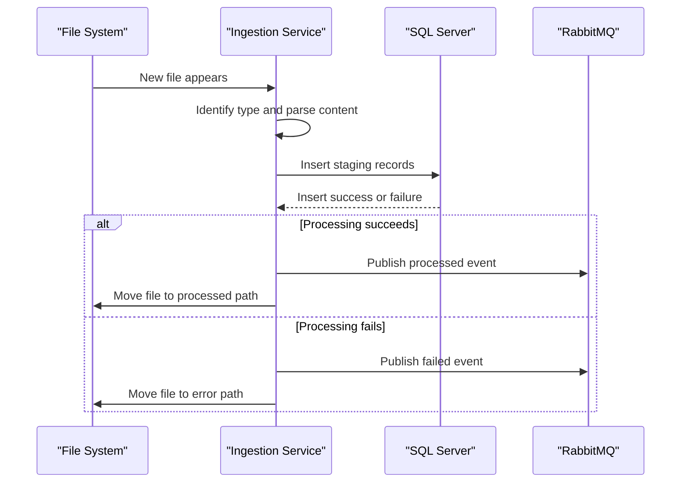

# API & Service Communication Contracts

The application exposes no HTTP API endpoints and operates as a background ingestion service. Communication is asynchronous outbound messaging to RabbitMQ after file processing.

## Service Catalog

| Service | Port | Category | Purpose |
|---|---|---|---|
| zava-file-ingestion | N/A | Business | Poll files, parse records, persist data, publish ingest events |
| rabbitmq | 5672 | Infrastructure | Receives ingestion status events via topic exchange |
| sqlserver | 1433 | Infrastructure | Stores ingestion staging records |

## API Endpoints Inventory

> ERROR: No recognized API endpoints found at workspace path. Verify the path is correct.

## Management & Observability Endpoints

| Service | Endpoint | Custom Metrics (if any) |
|---|---|---|
| zava-file-ingestion | None detected | None detected |

## DTOs & Contracts

No REST DTO classes were identified. The primary contract is an event JSON payload containing `eventType`, `fileName`, `fileType`, `status`, and `ingestedAt` published to RabbitMQ routing key `file.ingested`.

## Communication Patterns

- **Synchronous**: Local method calls for parsing and DB insert operations.
- **Asynchronous**: RabbitMQ publish to `zava.events` exchange after success/failure.
- **Resilience patterns**: No explicit retry/circuit breaker/timeout policies beyond basic exception handling.
- **Service discovery**: None; host and port are configured directly.
- **Security posture**: No TLS, authentication, or authorization at API contract level because no HTTP API exists.

## Service Technology Matrix

| Service | Web | Data Access | Discovery | Gateway | Actuator | Cache | Metrics |
|---|---|---|---|---|---|---|---|
| zava-file-ingestion | None | JDBC | None | No | No | No | No |

## Service Communication Sequence

