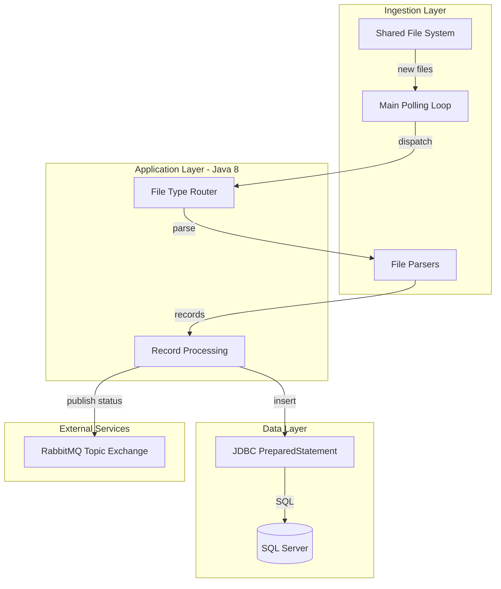
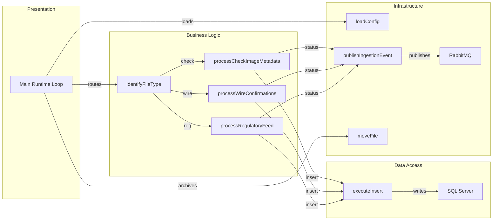

# Architecture Diagram

This Java batch-style service continuously ingests files, writes parsed records to SQL Server, and publishes ingestion events to RabbitMQ. The architecture is a single-process worker with clear ingestion, persistence, and messaging responsibilities.

## Application Architecture

### Technology Stack Summary

| Layer | Technology | Version | Purpose |
|---|---|---|---|
| Ingestion | Java file I/O | Java 8 | Poll and read inbound files |
| Processing | Custom parser logic | N/A | Parse check, wire, and regulatory files |
| Data Access | Microsoft SQL Server JDBC | 12.6.1.jre8 | Persist staging records |
| Messaging | RabbitMQ Java Client | 5.21.0 | Publish ingestion outcome events |

### Data Storage & External Services

The service persists parsed rows into SQL Server staging tables (`StagingCheckImage`, `StagingWireConfirmation`, `StagingRegulatoryFeed`) and emits asynchronous status messages to RabbitMQ (`zava.events` exchange).

### Key Architectural Decisions

- File-type-based branching routes each file into dedicated parsing logic.
- Inserts use parameterized SQL through `PreparedStatement`.
- Processing outcome drives both file movement (processed/error) and event publication.

## Component Relationships

### Component Inventory

| Component | Layer | Type | Responsibility |
|---|---|---|---|
| Main Runtime Loop | Presentation | Entry process | Poll directories and orchestrate ingestion |
| identifyFileType | Business Logic | Classifier | Determine file processing path |
| processCheckImageMetadata | Business Logic | Parser | Parse check image CSV metadata |
| processWireConfirmations | Business Logic | Parser | Parse fixed-width wire confirmations |
| processRegulatoryFeed | Business Logic | Parser | Parse regulatory feed records |
| executeInsert | Data Access | Persistence helper | Execute parameterized SQL inserts |
| publishIngestionEvent | Infrastructure | Messaging adapter | Emit event messages to RabbitMQ |
| loadConfig | Infrastructure | Config loader | Load properties and env overrides |
| moveFile | Infrastructure | File utility | Move file to processed or error folder |
