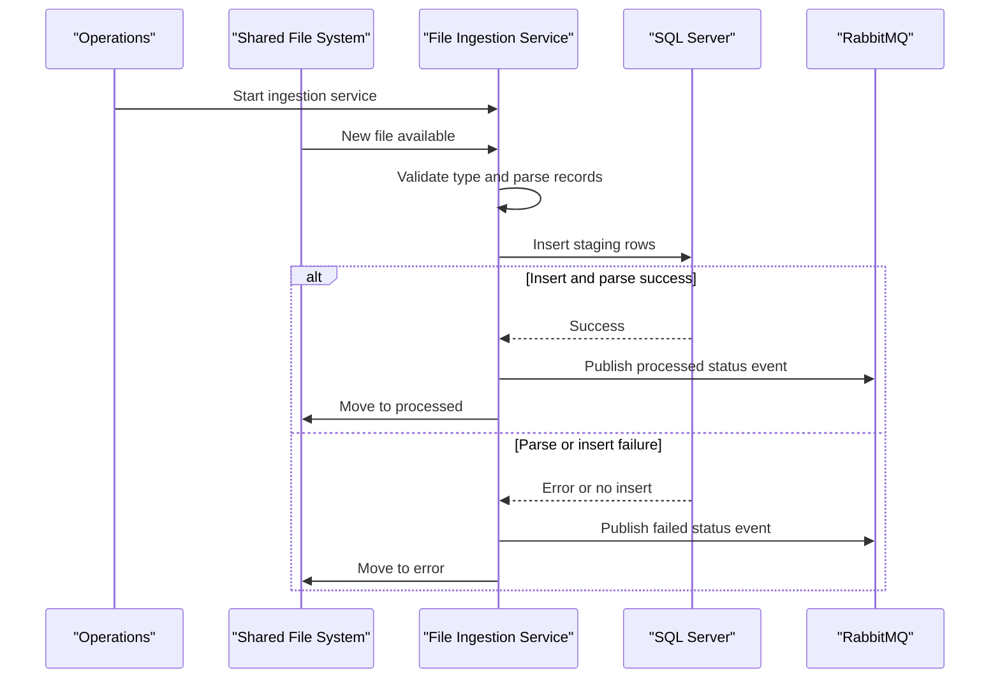

# Core Business Workflows

The application ingests banking-related files from a shared location, converts records into staging data, and publishes ingestion outcomes. Its core domain is reliable file intake and downstream notification.

## Domain Entities

| Entity | Service / Bounded Context | Description | Key Relationships |
|---|---|---|---|
| File Ingestion Job | Ingestion | Represents processing lifecycle for one file | Produces one or more staging rows |
| Check Image Record | Ingestion | Parsed check-image metadata | Linked to source file |
| Wire Confirmation Record | Ingestion | Parsed wire confirmation entry | Linked to source file |
| Regulatory Feed Record | Ingestion | Parsed regulatory feed entry | Linked to source file |
| Ingestion Event | Notification | Outcome event for consumers | Emitted after process success/failure |

## Service-to-Domain Mapping

| Service | Domain Context | Owned Entities | External Dependencies |
|---|---|---|---|
| zava-file-ingestion | File Ingestion | File Ingestion Job, staging records, ingestion event payload | SQL Server, RabbitMQ, shared filesystem |

## Primary Workflows

### Workflow 1: Process inbound file

1. Poll ingestion directory.
2. Identify supported file type (check, wire, regulatory).
3. Parse file content into records.
4. Insert records into type-specific staging table.
5. Publish success/failure event.
6. Move file to processed or error folder.

### Workflow 2: Graceful shutdown

1. Shutdown hook toggles running flag.
2. Poll loop exits after current cycle.
3. Service logs stop event.

## Cross-Service Data Flows

The service composes data from filesystem input and publishes event outcomes to RabbitMQ after persistence to SQL Server. If parsing or inserts fail, the business fallback is to publish a failed status and move the file to the error path.

## Business Workflow Sequence

## Business Rules & Decision Logic

- File-type decision rules route by filename patterns and extensions.
- Unsupported file types are skipped and not processed.
- Any parse/insert failure marks workflow as failed and routes file to error path.
- Processing success requires at least one successful DB insert for multi-row files.
