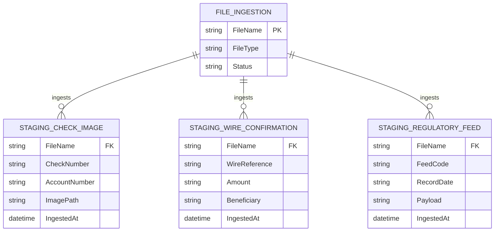

# Data Architecture & Persistence Layer

The persistence layer uses direct JDBC inserts into SQL Server staging tables. The model is ingestion-focused, with file-derived records written to separate staging entities.

## Database Configuration

| Service/Module | DB Type | Profile | Driver | Connection | Migration Tool |
|---|---|---|---|---|---|
| zava-file-ingestion | SQL Server | default | com.microsoft.sqlserver:mssql-jdbc | JDBC URL in properties/env override | None detected |

## Data Ownership per Service

| Service | Tables Owned | ORM Framework | Caching | Notes |
|---|---|---|---|---|
| zava-file-ingestion | StagingCheckImage, StagingWireConfirmation, StagingRegulatoryFeed | JDBC (no ORM) | None detected | Writes only; staging ingestion workload |

## Entity Model



## Key Repository Methods

| Service | Repository | Notable Methods | Purpose |
|---|---|---|---|
| zava-file-ingestion | Main (JDBC helper) | `executeInsert(...)` | Shared insert execution with prepared statements |
| zava-file-ingestion | Main | `insertCheckImageMetadata(...)` | Insert check image staging row |
| zava-file-ingestion | Main | `insertWireConfirmation(...)` | Insert wire confirmation staging row |
| zava-file-ingestion | Main | `insertRegulatoryFeed(...)` | Insert regulatory feed staging row |

## Caching Strategy

No cache provider, cache annotations, or cache-aside/read-through patterns were detected.

## Data Ownership Boundaries

A single service writes all staging records to a shared SQL Server database using direct inserts. No cross-service database access patterns were identified.

### Data Classification & Sensitivity

| Entity | Sensitive Fields | Classification (PII/PHI/PCI/None) | Controls in Place |
|---|---|---|---|
| STAGING_CHECK_IMAGE | AccountNumber | PII | No explicit masking/encryption controls detected in code |
| STAGING_WIRE_CONFIRMATION | Beneficiary | PII | No explicit masking/encryption controls detected in code |
| STAGING_REGULATORY_FEED | Payload | Potential confidential | No explicit masking/encryption controls detected in code |
```
