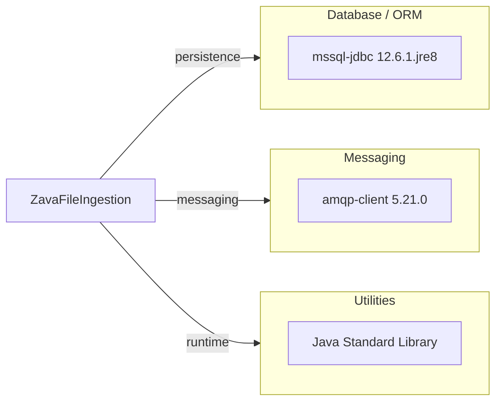

# Dependency Map

This project declares 2 runtime dependencies in Gradle, centered on database and messaging integration.

## Dependencies

### Dependency Summary

| Category | Count | Key Libraries | Notes |
|---|---:|---|---|
| Database / ORM | 1 | mssql-jdbc 12.6.1.jre8 | SQL Server connectivity |
| Messaging | 1 | amqp-client 5.21.0 | RabbitMQ publish support |
| Utilities | 0 | Java standard library | Built-in Java APIs |

### Version & Compatibility Risks

Java target compatibility is set to Java 8 while modernization config targets newer runtime baselines. JDBC and RabbitMQ client versions should be validated against the target runtime selected for migration.

### Notable Observations

- No explicit logging library is declared; standard output logging is used.
- No test dependencies were detected in Gradle declarations.
- Dependency footprint is small, reducing migration blast radius.

## Test Dependencies

| Framework | Version | Notes |
|---|---|---|
| None detected | N/A | No test-scope dependencies declared |

Total test-scope dependencies: 0
No test dependencies detected.
