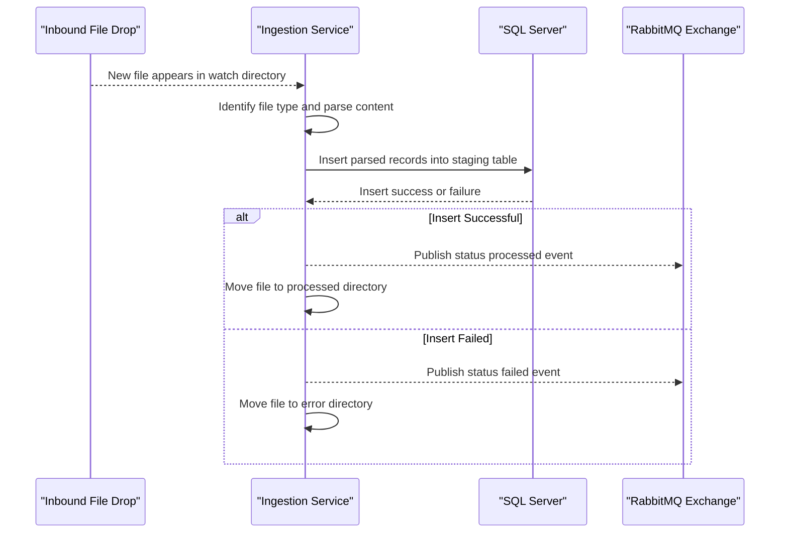

# API & Service Communication Contracts

ZavaFileIngestion exposes no HTTP API surface; communication is file-driven input with asynchronous event publication. Contracts are defined by file formats, SQL staging inserts, and RabbitMQ event payloads.

## Service Catalog

| Service | Port | Category | Purpose |
|---|---|---|---|
| zava-file-ingestion | N/A | Business | Polls inbound files, stores parsed data, and emits ingestion events |

## API Endpoints Inventory

> ERROR: No recognized API endpoints found at workspace-path. Verify the path is correct.

## Management & Observability Endpoints

| Service | Endpoint | Custom Metrics (if any) |
|---|---|---|
| zava-file-ingestion | None detected | None detected |

## DTOs & Contracts

No HTTP DTO classes were found. Contract types are implicit:
- Inbound check metadata CSV row to SQL `StagingCheckImage` insert contract
- Inbound wire confirmation fixed-width row to SQL `StagingWireConfirmation` insert contract
- Inbound regulatory CSV row to SQL `StagingRegulatoryFeed` insert contract
- Outbound RabbitMQ JSON event payload (`eventType`, `fileName`, `fileType`, `status`, `ingestedAt`)

## Communication Patterns

The service performs synchronous communication to SQL Server via JDBC for all inserts and asynchronous communication to RabbitMQ via topic publish for status updates. No circuit breaker, retry policy, service discovery, API gateway, or transport-level TLS configuration is defined in code-level contracts. No authentication or authorization controls are configured at API level because no HTTP endpoints are exposed.

## Service Technology Matrix

| Service | Web | Data Access | Discovery | Gateway | Actuator | Cache | Metrics |
|---|---|---|---|---|---|---|---|
| zava-file-ingestion | None | JDBC | None | None | None | None | None |

## Service Communication Sequence

