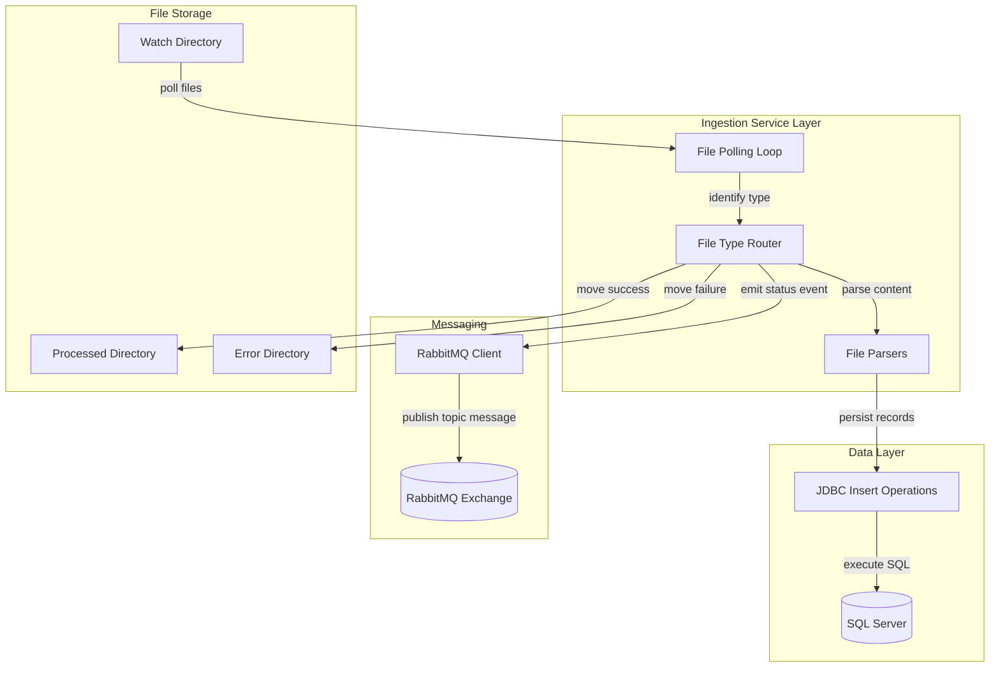
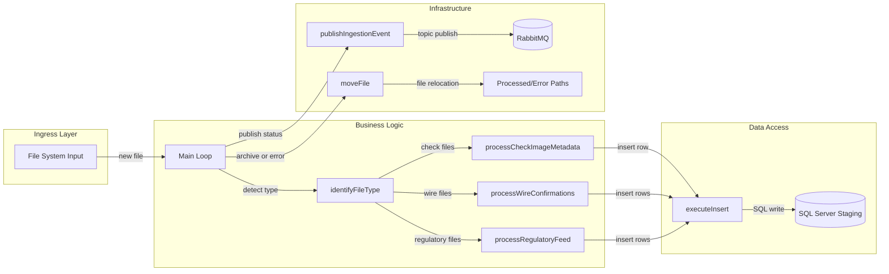

# Architecture Diagram

This document summarizes the runtime architecture and internal component relationships for ZavaFileIngestion.

## Application Architecture

### Technology Stack Summary

| Layer | Technology | Version | Purpose |
|---|---|---|---|
| Service Runtime | Java SE | 8 | Background file ingestion process |
| Build/Packaging | Gradle + Shadow JAR | Gradle 7.6 image / plugin 7.1.2 | Build executable fat JAR |
| Data Access | JDBC (mssql-jdbc) | 12.6.1.jre8 | Insert staging records into SQL Server |
| Messaging | RabbitMQ Java Client | 5.21.0 | Publish ingestion completion/failure events |
| Container Runtime | Eclipse Temurin JRE | 8 | Run ingestion service container |

### Data Storage & External Services

The service writes parsed records to SQL Server staging tables and publishes ingestion status messages to a RabbitMQ topic exchange. It also depends on mounted file-system paths for input, processed output, and error handling.

### Key Architectural Decisions

- Uses a single-process polling architecture with file-type driven routing.
- Persists each file category into dedicated staging tables via parameterized JDBC inserts.
- Publishes an event after each file outcome to decouple downstream consumers from ingestion internals.

## Component Relationships

### Component Inventory

| Component | Layer | Type | Responsibility |
|---|---|---|---|
| Main | Business Logic | Entry Point | Runs polling loop and coordinates ingestion |
| identifyFileType | Business Logic | Routing Function | Classifies file type from naming/extension hints |
| processCheckImageMetadata | Business Logic | Parser | Parses check metadata CSV and sends inserts |
| processWireConfirmations | Business Logic | Parser | Parses fixed-width wire confirmations |
| processRegulatoryFeed | Business Logic | Parser | Parses regulatory feed CSV rows |
| executeInsert | Data Access | JDBC Helper | Executes parameterized SQL insert statements |
| publishIngestionEvent | Infrastructure | Messaging Adapter | Publishes ingestion events to RabbitMQ exchange |
| moveFile | Infrastructure | File Utility | Moves files to processed/error directories |
