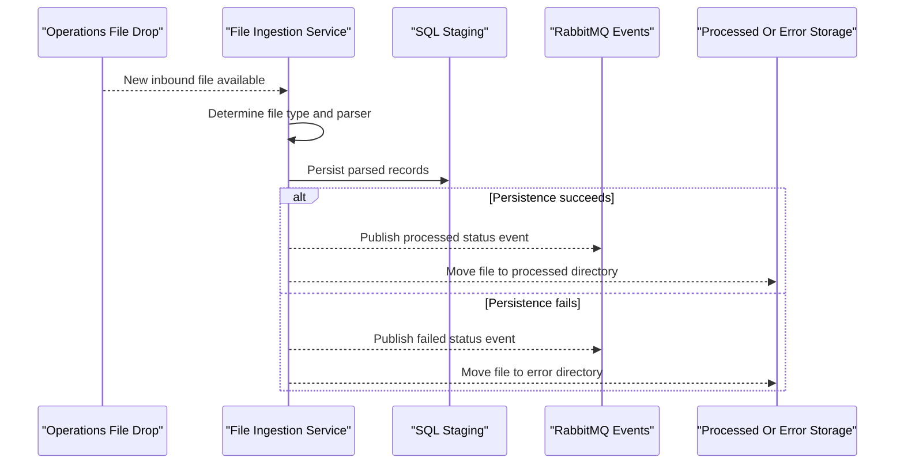

# Core Business Workflows

ZavaFileIngestion automates back-office ingestion of inbound banking files into staging storage and downstream events. Its domain centers on classification, parsing, persistence, and operational status signaling.

## Domain Entities

| Entity | Service / Bounded Context | Description | Key Relationships |
|---|---|---|---|
| Check Image Metadata | File Ingestion | Parsed check-related ingestion payload | Originates from check CSV input and persists to staging |
| Wire Confirmation | File Ingestion | Parsed wire transfer confirmation data | Originates from fixed-width text and persists to staging |
| Regulatory Feed Record | File Ingestion | Parsed regulatory data payload | Originates from CSV feed rows and persists to staging |
| Ingestion Event | File Ingestion | Published status event for each processed file | Emitted after processing to RabbitMQ exchange |

## Service-to-Domain Mapping

| Service | Domain Context | Owned Entities | External Dependencies |
|---|---|---|---|
| zava-file-ingestion | File Intake and Staging | Check Image Metadata, Wire Confirmation, Regulatory Feed Record, Ingestion Event | SQL Server, RabbitMQ, shared file system |

## Primary Workflows

### Workflow 1: File Intake and Routing

The service polls the watch directory, inspects each filename, and routes supported file types to corresponding parsers. Unsupported files are skipped without mutation.

### Workflow 2: Parse, Persist, and Signal Outcome

For each supported file, parser logic extracts records and writes staging rows. Success moves files to processed storage and emits a `processed` event; failure moves files to error storage and emits a `failed` event.

## Cross-Service Data Flows

This is a single-service workflow. Data enters via shared storage, is transformed and persisted to SQL Server, then status is broadcast to RabbitMQ for downstream consumers. If persistence fails, event payload reflects failure and file is redirected to the error path.

## Business Workflow Sequence

## Business Rules & Decision Logic

- File type is determined primarily by extension and naming hints (`check`, `wire`, `reg`/`feed`).
- Empty lines are ignored for multi-line ingestion formats.
- A file is considered successful if at least one insert operation succeeds for multi-row handlers.
- Status outcome (`processed` or `failed`) controls both event publication payload and destination directory.
