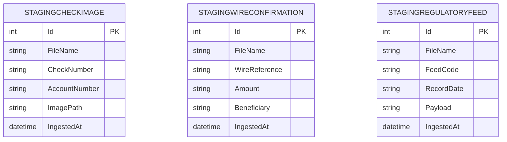

# Data Architecture & Persistence Layer

The data layer is implemented through direct JDBC access to SQL Server staging tables with no ORM entities. Persistence concerns center on three ingestion-specific table contracts and file-type driven inserts.

## Database Configuration

| Service/Module | DB Type | Profile | Driver | Connection | Migration Tool |
|---|---|---|---|---|---|
| zava-file-ingestion | SQL Server | default | com.microsoft.sqlserver:mssql-jdbc 12.6.1.jre8 | JDBC URL from properties or env override | None detected |

## Data Ownership per Service

| Service | Tables Owned | ORM Framework | Caching | Notes |
|---|---|---|---|---|
| zava-file-ingestion | StagingCheckImage, StagingWireConfirmation, StagingRegulatoryFeed | JDBC (no ORM) | None | Writes staging records only |

## Entity Model

## Key Repository Methods

| Service | Repository | Notable Methods | Purpose |
|---|---|---|---|
| zava-file-ingestion | Main.executeInsert | `executeInsert(Properties, String, String[])` | Shared low-level SQL insert execution |
| zava-file-ingestion | Main.processCheckImageMetadata | `insertCheckImageMetadata(...)` | Writes check image metadata row |
| zava-file-ingestion | Main.processWireConfirmations | `insertWireConfirmation(...)` | Writes wire confirmation rows |
| zava-file-ingestion | Main.processRegulatoryFeed | `insertRegulatoryFeed(...)` | Writes regulatory feed rows |

## Caching Strategy

No application cache provider or cache-aside strategy was detected. Each file processing cycle reads source files directly and writes directly to SQL Server.

## Data Ownership Boundaries

The application is a single service with direct ownership of staging insert operations. There are no cross-service data access patterns; integration boundaries are SQL Server for persistence and RabbitMQ for event distribution.

### Data Classification & Sensitivity

| Entity | Sensitive Fields | Classification (PII/PHI/PCI/None) | Controls in Place |
|---|---|---|---|
| STAGINGCHECKIMAGE | AccountNumber | PII | No explicit encryption or masking detected |
| STAGINGWIRECONFIRMATION | Beneficiary, Amount | PII | No explicit encryption or masking detected |
| STAGINGREGULATORYFEED | Payload | Confidential | No explicit encryption or masking detected |
