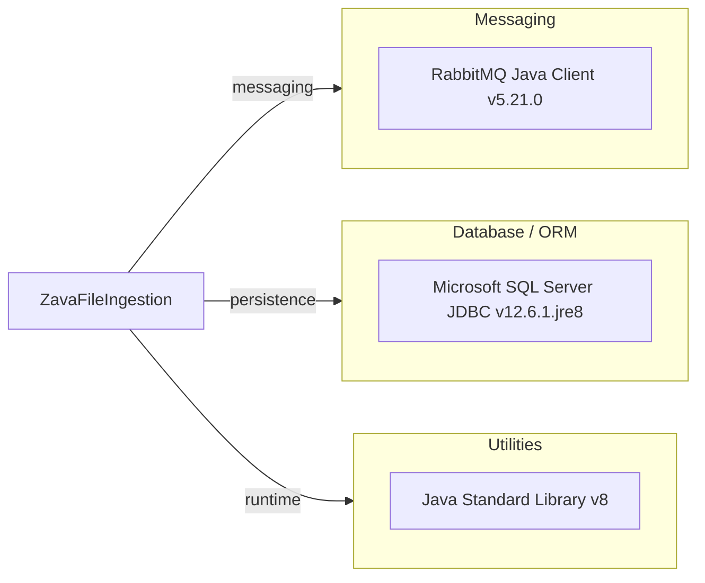

# Dependency Map

This map summarizes declared external dependencies for ZavaFileIngestion. The project declares 2 runtime dependencies.

## Dependencies

### Dependency Summary

| Category | Count | Key Libraries | Notes |
|---|---:|---|---|
| Messaging | 1 | amqp-client 5.21.0 | Publishes ingestion events to RabbitMQ |
| Database / ORM | 1 | mssql-jdbc 12.6.1.jre8 | JDBC driver for SQL Server staging writes |
| Utilities | 1 | Java SE 8 | Core runtime and standard APIs |

### Version & Compatibility Risks

The service targets Java 8 and uses a Shadow plugin version that fails under newer Gradle runtime tooling, indicating potential modernization work for build/runtime alignment. JDBC and RabbitMQ dependencies are explicit and should be validated for target platform support during migration.

### Notable Observations

- Dependency footprint is intentionally small and focused on SQL + messaging.
- No explicit logging framework dependency is declared beyond standard output.
- No security framework or observability library is declared in build dependencies.

## Test Dependencies

| Framework | Version | Notes |
|---|---|---|
| None detected | N/A | No test-scoped dependencies declared in build.gradle |

Total test-scope dependencies: 0
No test dependencies detected.
