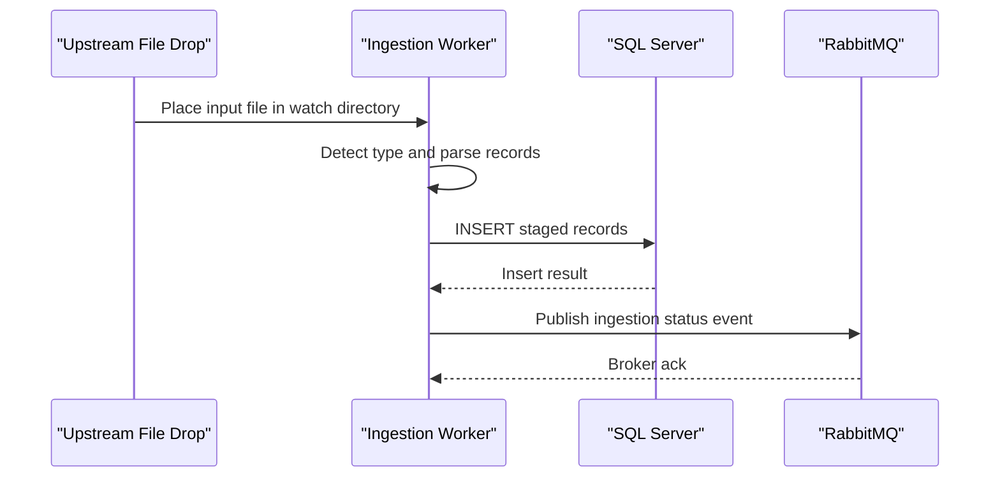

# API & Service Communication Contracts

The repository exposes no HTTP API endpoints; communication is filesystem-driven input plus asynchronous RabbitMQ event publishing.

## Service Catalog

| Service | Port | Category | Purpose |
|---|---|---|---|
| mnm-ZavaFileIngestion | N/A | Business | Ingest files, stage data in SQL Server, publish status events |

## API Endpoints Inventory

> No recognized HTTP API endpoints found in this codebase.

## Management & Observability Endpoints

| Service | Endpoint | Custom Metrics |
|---|---|---|
| mnm-ZavaFileIngestion | None detected | None detected |

## DTOs & Contracts

Contract payloads are lightweight event messages emitted by `publishIngestionEvent` and SQL insert values generated from parsed file lines. DTO classes are not defined; payloads are composed inline.

## Communication Patterns

Synchronous operations: local file reading and SQL Server JDBC inserts. Asynchronous operations: RabbitMQ topic publish with routing key `file.ingested` for processed/failed events. No circuit breaker/retry framework or API-level auth/TLS controls were detected in code.

## Service Technology Matrix

| Service | Web | Data Access | Discovery | Gateway | Actuator | Cache | Metrics |
|---|---|---|---|---|---|---|---|
| mnm-ZavaFileIngestion | None | JDBC | None | None | None | None | None |

## Service Communication Sequence

