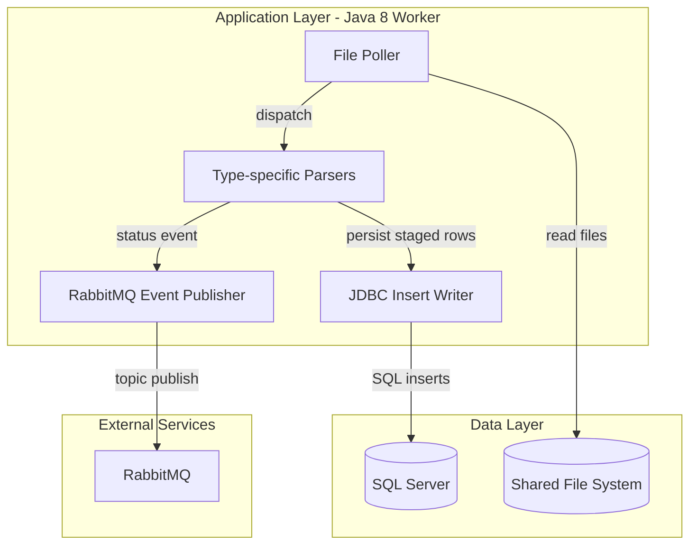
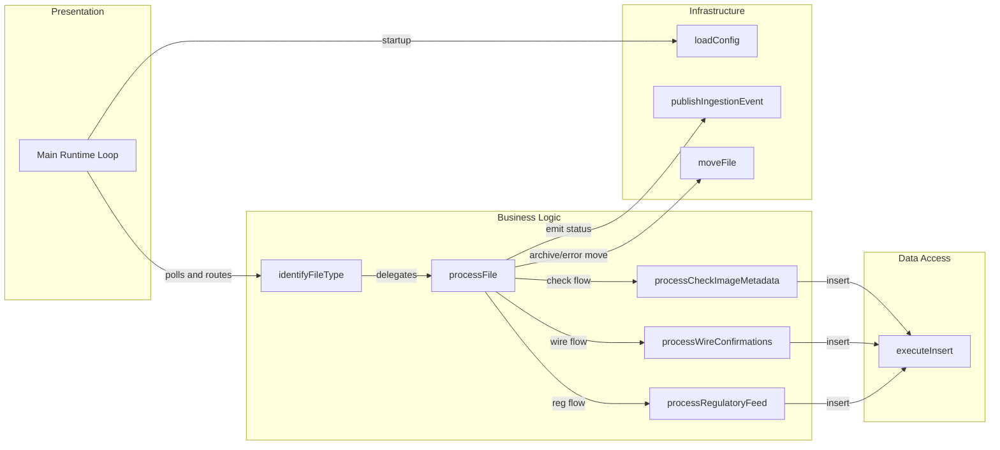

# Architecture Diagram

This application is a single Java worker service that ingests files, writes staging records to SQL Server, and emits ingestion events to RabbitMQ.

## Application Architecture

### Technology Stack Summary

| Layer | Technology | Version | Purpose |
|---|---|---|---|
| Application | Java service | 8 | Poll and process inbound files |
| Persistence | SQL Server JDBC | 12.6.1.jre8 | Insert staged ingestion records |
| Messaging | RabbitMQ Java Client | 5.21.0 | Publish processed/failed events |

### Data Storage & External Services

The service reads from filesystem directories and writes records to SQL Server staging tables. RabbitMQ is used as an external integration to publish ingestion outcome notifications.

### Key Architectural Decisions

- Uses a single-process polling loop with configurable interval.
- Uses direct JDBC prepared statements instead of ORM.
- Uses topic-based RabbitMQ publishing for downstream event consumers.

## Component Relationships

### Component Inventory

| Component | Layer | Type | Responsibility |
|---|---|---|---|
| Main | Presentation | Entry loop | Polls ingestion path and orchestrates processing |
| identifyFileType | Business Logic | Classifier | Determines file category by naming convention |
| process* methods | Business Logic | Processors | Parse file records and map to staging inserts |
| executeInsert | Data Access | JDBC helper | Executes prepared SQL inserts |
| publishIngestionEvent | Infrastructure | Messaging adapter | Publishes processing status to RabbitMQ |
| loadConfig | Infrastructure | Config loader | Loads properties and environment overrides |
