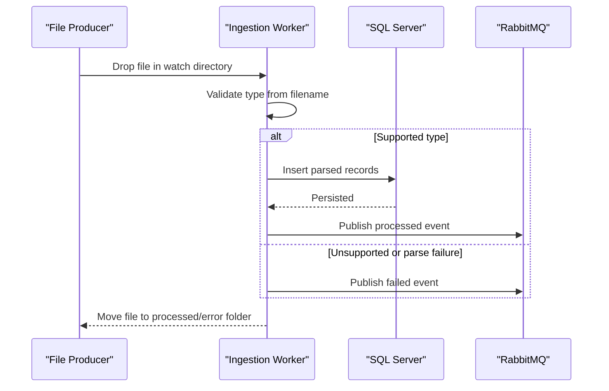

# Core Business Workflows

The service ingests inbound operational files and transforms them into staged database records while emitting ingestion status events for downstream consumers.

## Domain Entities

| Entity | Service / Bounded Context | Description | Key Relationships |
|---|---|---|---|
| Check Image Metadata | File Ingestion | Metadata extracted from check image files | Persisted to check staging table |
| Wire Confirmation | File Ingestion | Confirmation records for wire transfers | Persisted to wire staging table |
| Regulatory Feed Record | File Ingestion | Regulatory feed payload rows | Persisted to regulatory staging table |
| Ingestion Event | File Ingestion | Processed/failed notification message | Published to RabbitMQ topic |

## Service-to-Domain Mapping

| Service | Domain Context | Owned Entities | External Dependencies |
|---|---|---|---|
| mnm-ZavaFileIngestion | File Ingestion | Check Image Metadata, Wire Confirmation, Regulatory Feed Record, Ingestion Event | SQL Server, RabbitMQ, shared filesystem |

## Primary Workflows

### Workflow 1: Process inbound file

1. Poll watch directory for non-processed files.
2. Classify file type by naming and extension conventions.
3. Parse rows and transform to staging insert payload.
4. Persist rows to SQL Server staging tables.
5. Move file to processed folder on success, or error folder on failure.
6. Publish processed/failed event to RabbitMQ.

## Cross-Service Data Flows

There is no internal microservice choreography. Data flows from file producers into this service, then outward to SQL Server (persistent staging) and RabbitMQ (asynchronous event consumers).

## Business Workflow Sequence

## Business Rules & Decision Logic

- Files containing `processed` or `error` in the name are skipped.
- `check` + `.csv` routes to check-image flow, `wire` + `.txt` to wire flow, and `reg/feed` + `.csv/.txt` to regulatory flow.
- A successful database insert determines whether the file is archived as processed or failed.
