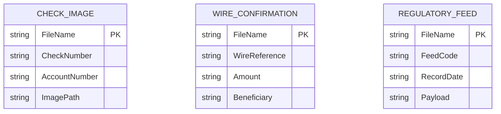

# Data Architecture & Persistence Layer

The data layer uses direct JDBC writes to SQL Server staging tables without an ORM or repository abstraction.

## Database Configuration

| Service/Module | DB Type | Profile | Driver | Connection | Migration Tool |
|---|---|---|---|---|---|
| mnm-ZavaFileIngestion | SQL Server | default | com.microsoft.sqlserver:mssql-jdbc | JDBC URL from `db.url` | None detected |

## Data Ownership per Service

| Service | Tables Owned | ORM Framework | Caching | Notes |
|---|---|---|---|---|
| mnm-ZavaFileIngestion | StagingCheckImage, StagingWireConfirmation, StagingRegulatoryFeed | JDBC (no ORM) | None | Inserts rows with ingestion timestamp |

## Entity Model

## Key Repository Methods

| Service | Repository | Notable Methods | Purpose |
|---|---|---|---|
| mnm-ZavaFileIngestion | Main (JDBC helper methods) | `insertCheckImageMetadata`, `insertWireConfirmation`, `insertRegulatoryFeed`, `executeInsert` | Writes parsed data into staging tables |

## Caching Strategy

No caching provider or cache-aside behavior was detected.

## Data Ownership Boundaries

A single service writes directly to a single SQL Server schema. No cross-service DB ownership boundaries were identified.

### Data Classification & Sensitivity

| Entity | Sensitive Fields | Classification (PII/PHI/PCI/None) | Controls in Place |
|---|---|---|---|
| CHECK_IMAGE | AccountNumber | PII | No masking/encryption controls detected in code |
| WIRE_CONFIRMATION | Beneficiary | PII | No masking/encryption controls detected in code |
| REGULATORY_FEED | Payload | Internal | No additional controls detected |
