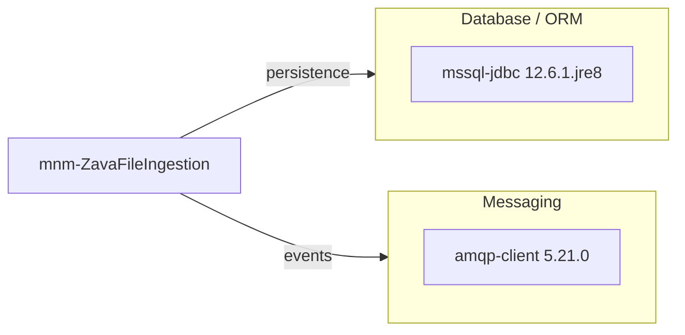

# Dependency Map

This project declares two runtime dependencies focused on data persistence and messaging.

## Dependencies

### Dependency Summary

| Category | Count | Key Libraries | Notes |
|---|---:|---|---|
| Database / ORM | 1 | mssql-jdbc | Direct JDBC access to SQL Server |
| Messaging | 1 | amqp-client | Publishes ingestion events |

### Version & Compatibility Risks

The project is pinned to Java 8-compatible artifacts and uses Shadow plugin 7.1.2, which is not compatible with Gradle 9 environments.

### Notable Observations

- Minimal dependency surface lowers migration complexity.
- No explicit observability or security framework dependencies were declared.
- No test-scope dependencies were declared in the Gradle file.

## Test Dependencies

No test-scoped dependencies were detected in `build.gradle`.

Total test-scope dependencies: 0
