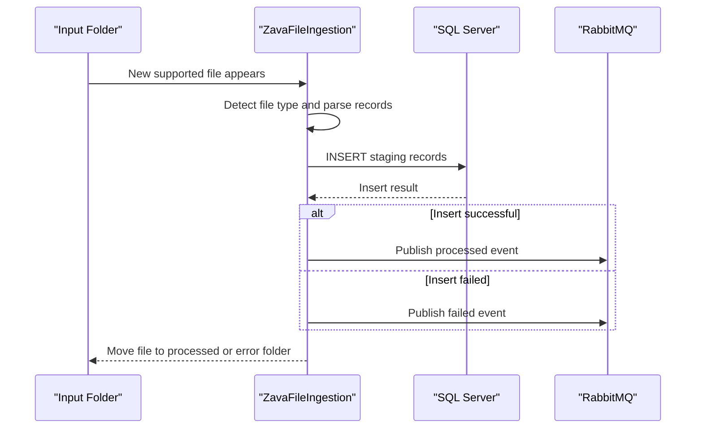

# API & Service Communication Contracts

This repository implements a background ingestion worker and uses internal method-based workflows rather than HTTP APIs; communication is file-driven plus outbound AMQP events.

## Service Catalog

| Service | Port | Category | Purpose |
|---|---|---|---|
| ZavaFileIngestion | N/A | Business | Poll files, insert staging rows, publish ingestion events |
| SQL Server | 1433 | Infrastructure | Stores ingestion staging data |
| RabbitMQ | 5672 | Infrastructure | Receives ingestion status events |

## API Endpoints Inventory

| Service | Method | Path | Request Type | Response Type |
|---|---|---|---|---|
| ZavaFileIngestion | N/A | N/A | File drop + config properties | DB writes and AMQP events |

## Management & Observability Endpoints

| Service | Endpoint | Custom Metrics (if any) |
|---|---|---|
| ZavaFileIngestion | None detected | None detected |

## DTOs & Contracts

The service uses file line payloads as its primary input contract and AMQP JSON messages as output contracts. No dedicated API DTO classes or OpenAPI/protobuf schemas were detected.

## Communication Patterns

Synchronous behavior is local method orchestration and JDBC writes. Asynchronous behavior is RabbitMQ event publication after each file outcome. No circuit breaker, retry policy framework, service discovery, API gateway, TLS enforcement, or authentication/authorization layer was detected in this repository.

## Service Technology Matrix

| Service | Web | Data Access | Discovery | Gateway | Actuator | Cache | Metrics |
|---|---|---|---|---|---|---|---|
| ZavaFileIngestion | None | JDBC | None | No | No | No | No |

## Service Communication Sequence

