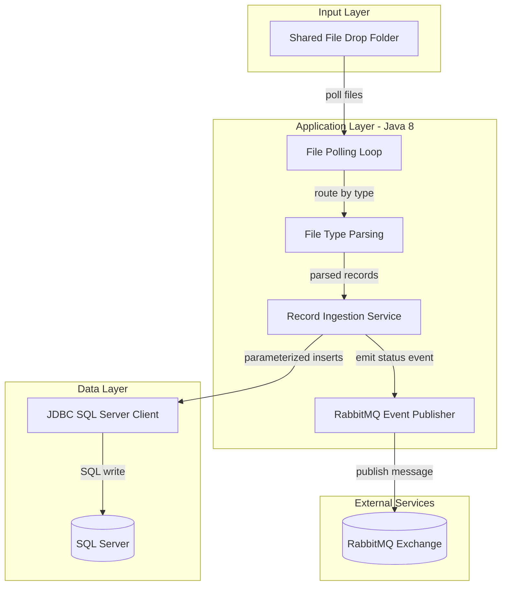
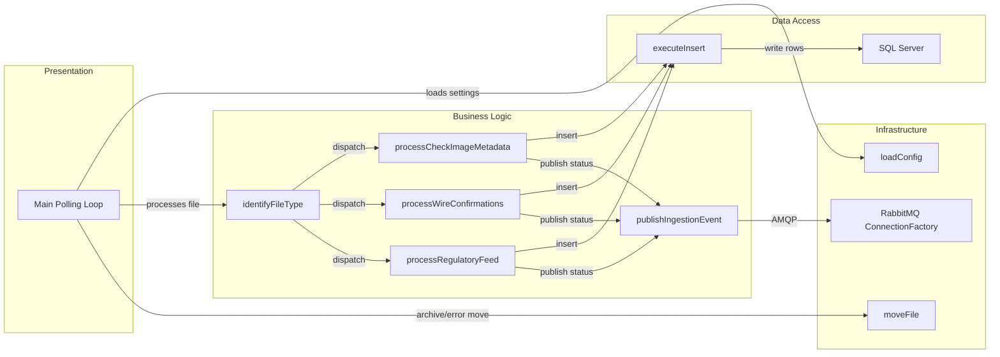

# Architecture Diagram

This application is a single-process Java file-ingestion worker that polls a shared directory, writes parsed records to SQL Server, and publishes ingestion events to RabbitMQ.

## Application Architecture

### Technology Stack Summary

| Layer | Technology | Version | Purpose |
|---|---|---|---|
| Application | Java SE | 8 | Batch-style ingestion runtime |
| Build | Gradle + Shadow | 7.1.2 plugin | Build and fat-jar packaging |
| Data Access | JDBC (mssql-jdbc) | 12.6.1.jre8 | Inserts staging rows into SQL Server |
| Messaging | RabbitMQ Java Client | 5.21.0 | Publishes ingestion lifecycle events |

### Data Storage & External Services

The service writes ingestion rows into SQL Server staging tables and publishes processing status notifications to RabbitMQ. It relies on filesystem directories for inbound, processed, and error file movement.

### Key Architectural Decisions

- Uses a single executable worker loop instead of HTTP controllers.
- Uses prepared JDBC statements for database writes.
- Uses RabbitMQ topic-style routing for downstream event processing.

## Component Relationships

### Component Inventory

| Component | Layer | Type | Responsibility |
|---|---|---|---|
| Main polling loop | Presentation | Entry-point loop | Polls watch directory and orchestrates ingestion |
| identifyFileType | Business Logic | Routing helper | Determines parser path by filename conventions |
| processCheckImageMetadata/processWireConfirmations/processRegulatoryFeed | Business Logic | Workflow handlers | Parse file lines and map to staging inserts |
| executeInsert | Data Access | JDBC helper | Executes parameterized SQL inserts |
| publishIngestionEvent | Business Logic | Integration method | Emits processed/failed notifications |
| loadConfig / moveFile | Infrastructure | Utility methods | Loads configuration and manages file movement |
