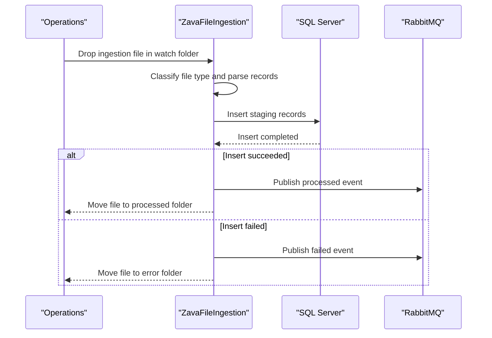

# Core Business Workflows

The application ingests operational banking files, normalizes records, and stages them for downstream systems while emitting processing status events.

## Domain Entities

| Entity | Service / Bounded Context | Description | Key Relationships |
|---|---|---|---|
| Check Image Metadata | File Ingestion | Metadata extracted from check files | Stored as staging rows and linked to source file |
| Wire Confirmation | File Ingestion | Wire transfer confirmation records | Stored as staging rows and linked to source file |
| Regulatory Feed Record | File Ingestion | Compliance feed payload records | Stored as staging rows and linked to source file |
| Ingestion Event | File Ingestion | Processed/failed event notification | Published to RabbitMQ after each file outcome |

## Service-to-Domain Mapping

| Service | Domain Context | Owned Entities | External Dependencies |
|---|---|---|---|
| ZavaFileIngestion | File ingestion and staging | Check metadata, wire confirmation, regulatory feed, ingestion events | SQL Server, RabbitMQ, filesystem paths |

## Primary Workflows

### Workflow 1: Process check image metadata file

The worker polls for CSV files with check naming hints, parses lines, inserts each record to `StagingCheckImage`, publishes success/failure status, and moves the file to processed/error folders.

### Workflow 2: Process wire confirmation file

The worker polls for TXT files with wire naming hints, slices fixed-width values, inserts rows to `StagingWireConfirmation`, publishes ingestion status, and archives file outcome.

### Workflow 3: Process regulatory feed file

The worker polls for CSV/TXT regulatory feed files, parses records, inserts rows into `StagingRegulatoryFeed`, emits events, and routes files by outcome.

## Cross-Service Data Flows

This repository contains a single business service. Cross-system flow is outbound: SQL Server receives normalized records while RabbitMQ receives ingestion outcome events. If downstream event publication fails, the workflow still logs the failure and file movement reflects overall processing result.

## Business Workflow Sequence

## Business Rules & Decision Logic

- File type routing is based on filename patterns (`check`, `wire`, `reg`/`feed`) and extension.
- Records are persisted with parameterized SQL statements and timestamped ingestion time.
- Processing outcome determines event status (`processed` or `failed`) and target folder.
- Unsupported or already processed/error-named files are skipped.
