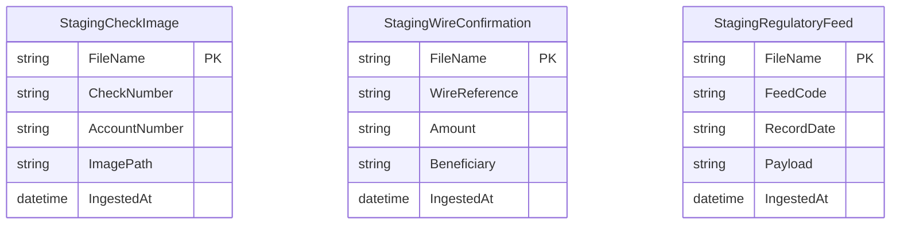

# Data Architecture & Persistence Layer

The application persists parsed ingestion records into SQL Server staging tables through JDBC prepared statements and does not define in-repo ORM entities.

## Database Configuration

| Service/Module | DB Type | Profile | Driver | Connection | Migration Tool |
|---|---|---|---|---|---|
| ZavaFileIngestion | SQL Server | default | com.microsoft.sqlserver:mssql-jdbc | `db.url` property in `fileingestion.properties` | None detected |

## Data Ownership per Service

| Service | Tables Owned | ORM Framework | Caching | Notes |
|---|---|---|---|---|
| ZavaFileIngestion | StagingCheckImage, StagingWireConfirmation, StagingRegulatoryFeed | JDBC (no ORM) | None | Writes staging rows only |

## Entity Model

## Key Repository Methods

| Service | Repository | Notable Methods | Purpose |
|---|---|---|---|
| ZavaFileIngestion | Main.java (JDBC helpers) | `executeInsert(sql, values)` | Central parameterized insert execution |
| ZavaFileIngestion | Main.java | `insertCheckImageMetadata(...)` | Persist check image metadata rows |
| ZavaFileIngestion | Main.java | `insertWireConfirmation(...)` | Persist wire confirmation rows |
| ZavaFileIngestion | Main.java | `insertRegulatoryFeed(...)` | Persist regulatory feed rows |

## Caching Strategy

No cache provider or cache-aside/read-through/write-through implementation was detected.

## Data Ownership Boundaries

All writes are performed by a single service into one SQL Server database schema, with no cross-service direct database access patterns in this repository.

### Data Classification & Sensitivity

| Entity | Sensitive Fields | Classification (PII/PHI/PCI/None) | Controls in Place |
|---|---|---|---|
| StagingCheckImage | AccountNumber | PII | No encryption or masking controls detected in repository |
| StagingWireConfirmation | Beneficiary | PII | No encryption or masking controls detected in repository |
| StagingRegulatoryFeed | Payload (undetermined content) | Internal | No explicit field-level controls detected |
