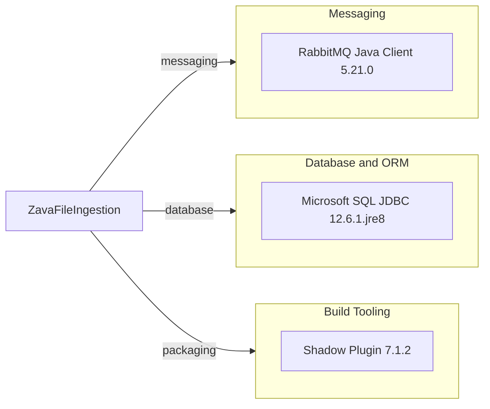

# Dependency Map

This Gradle-based Java project declares 2 runtime dependencies focused on messaging and SQL Server persistence.

## Dependencies

### Dependency Summary

| Category | Count | Key Libraries | Notes |
|---|---:|---|---|
| Messaging | 1 | com.rabbitmq:amqp-client | Publishes ingestion status events |
| Database / ORM | 1 | com.microsoft.sqlserver:mssql-jdbc | JDBC driver for SQL Server |
| Build Tooling | 1 | com.github.johnrengelman.shadow | Creates fat JAR |

### Version & Compatibility Risks

The Shadow plugin version 7.1.2 is not compatible with Gradle 9.x and currently blocks local build execution under that runtime.

### Notable Observations

- Runtime dependency graph is intentionally small and focused.
- No explicit observability/security frameworks are declared.
- No test-scoped dependencies are declared in `build.gradle`.

## Test Dependencies

| Framework | Version | Notes |
|---|---|---|
| N/A | N/A | No test-scoped dependencies declared |

Total test-scope dependencies: 0
No test dependencies detected in Gradle configuration.
